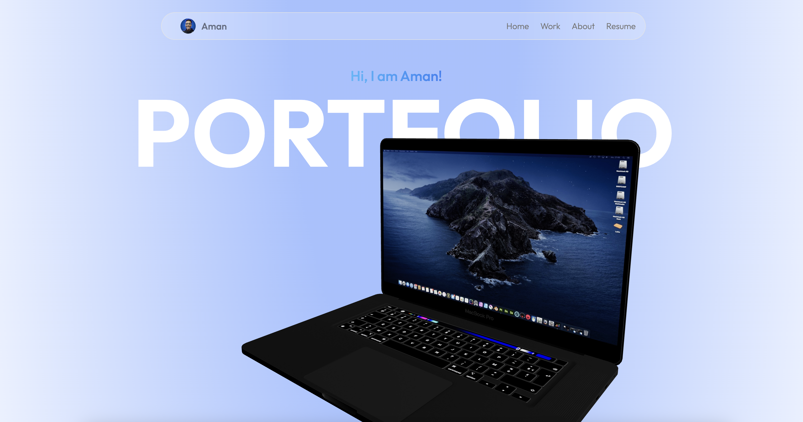
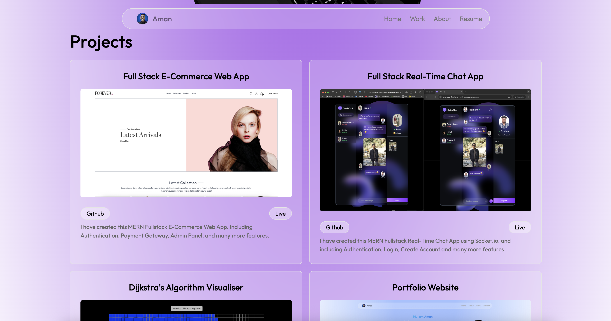
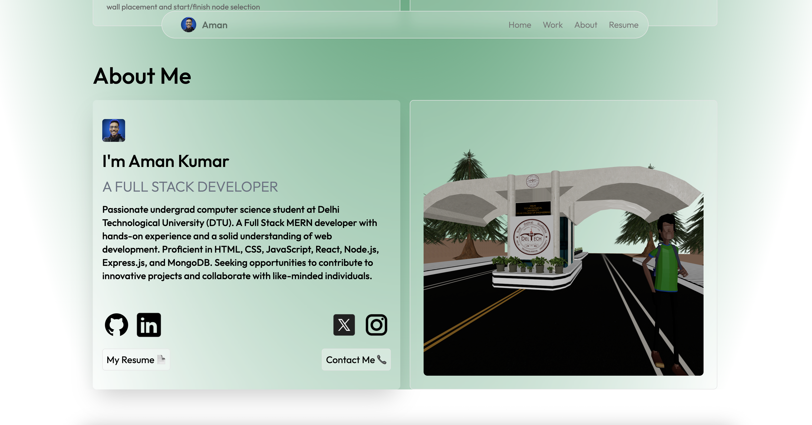

<h1>💻 Aman Kumar's 3D Portfolio Website

This is my personal portfolio website built using **React.js**, **Tailwind CSS**, and **Three.js** with `@react-three/fiber` and `drei`. It features a 3D animated laptop on the homepage and showcases my full-stack projects and background.

> ⚠️ **Note**: The 3D model of Delhi Technological University (DTU) used in this portfolio is an original creation by me (Aman Kumar) and is **not open for reuse or redistribution**.

---

---

## 🚀 Tech Stack

- **Frontend**: React.js, Tailwind CSS
- **3D Engine**: Three.js (`@react-three/fiber`, `@react-three/drei`)
- **Design**: Responsive with animated transitions
- **Deployment**: [Vercel](https://vercel.com)

---

## 📸 Live Demo

🔗 [Visit Portfolio](https://portfolio-wine-pi-12.vercel.app)

---

## 📁 Features

- Animated 3D models (Laptop, DTU Building)
- Custom loader while 3D assets load
- Section-wise scroll and color transitions
- Fully responsive layout
- Social links, resume download, and contact button
